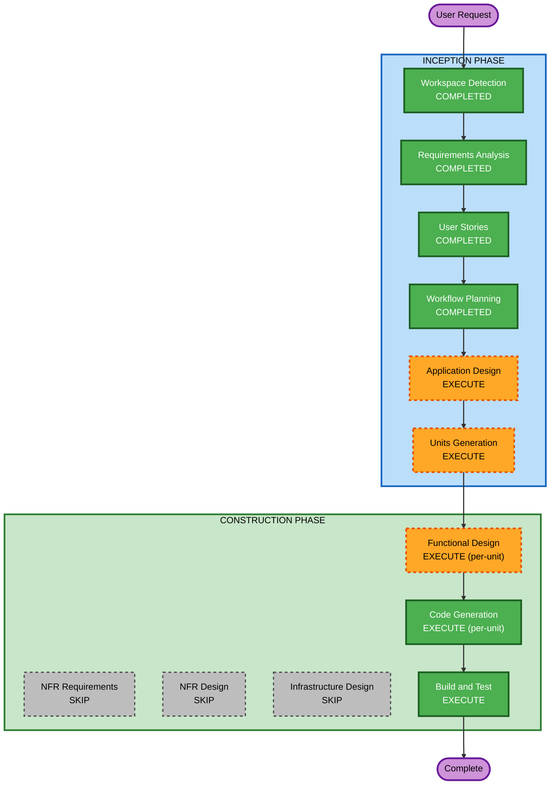

# Execution Plan — Phase 10 Web Application

## Detailed Analysis Summary

### Change Impact Assessment
- **User-facing changes**: Yes — entire new application (game UI, interactions, multiplayer)
- **Structural changes**: Yes — new modular architecture with 5+ components
- **Data model changes**: Yes — game state models, card/deck/player structures, persistence schema
- **API changes**: N/A — no server APIs (WebRTC data channel protocol needed)
- **NFR impact**: Minimal — straightforward static deployment, vanilla JS, basic accessibility

### Risk Assessment
- **Risk Level**: Medium (complex game logic, WebRTC P2P networking has edge cases)
- **Rollback Complexity**: Easy (greenfield, no existing system to break)
- **Testing Complexity**: Moderate (game rule validation, AI behavior, P2P connection handling)

---

## Workflow Visualization



### Text Alternative
```
Phase 1: INCEPTION
  - Workspace Detection (COMPLETED)
  - Requirements Analysis (COMPLETED)
  - User Stories (COMPLETED)
  - Workflow Planning (COMPLETED)
  - Application Design (EXECUTE)
  - Units Generation (EXECUTE)

Phase 2: CONSTRUCTION
  - Functional Design (EXECUTE, per-unit)
  - NFR Requirements (SKIP)
  - NFR Design (SKIP)
  - Infrastructure Design (SKIP)
  - Code Generation (EXECUTE, per-unit)
  - Build and Test (EXECUTE)
```

---

## Phases to Execute

### INCEPTION PHASE
- [x] Workspace Detection (COMPLETED)
- [x] Requirements Analysis (COMPLETED)
- [x] User Stories (COMPLETED)
- [x] Workflow Planning (IN PROGRESS)
- [ ] Application Design - EXECUTE
  - **Rationale**: Multiple new components needed (game engine, networking, AI, UI, storage). Component methods, interfaces, and dependencies need definition.
- [ ] Units Generation - EXECUTE
  - **Rationale**: System decomposes naturally into multiple independent units of work that can be designed and implemented sequentially.

### CONSTRUCTION PHASE
- [ ] Functional Design - EXECUTE (per-unit)
  - **Rationale**: Complex business logic requiring detailed design — game rules, phase validation algorithms, AI decision strategies, WebRTC protocol.
- [ ] NFR Requirements - SKIP
  - **Rationale**: Tech stack already decided (vanilla JS, static hosting). No complex NFR selection needed. All extensions declined. Performance/accessibility requirements are straightforward.
- [ ] NFR Design - SKIP
  - **Rationale**: NFR Requirements skipped. No NFR patterns to incorporate beyond standard web best practices already captured in requirements.
- [ ] Infrastructure Design - SKIP
  - **Rationale**: Static file deployment only. No cloud infrastructure, no server, no database. No infrastructure design needed.
- [ ] Code Generation - EXECUTE (per-unit, ALWAYS)
  - **Rationale**: Implementation planning and code generation for all units.
- [ ] Build and Test - EXECUTE (ALWAYS)
  - **Rationale**: Build instructions and testing strategy for the complete application.

### OPERATIONS PHASE
- [ ] Operations - PLACEHOLDER

---

## Success Criteria
- **Primary Goal**: Fully playable Phase 10 web application with online P2P multiplayer and AI opponents
- **Key Deliverables**:
  - Complete game engine with rule enforcement and phase validation
  - WebRTC-based online 2-player multiplayer
  - AI opponents (easy + hard)
  - Responsive, animated UI
  - Game persistence (localStorage)
  - Custom phase list support
- **Quality Gates**:
  - All 10 phases validate correctly
  - Scoring matches official rules
  - WebRTC connection establishes between two browsers
  - AI plays legal moves and completes games
  - UI works on mobile (320px+) and desktop
  - Keyboard navigation functional
